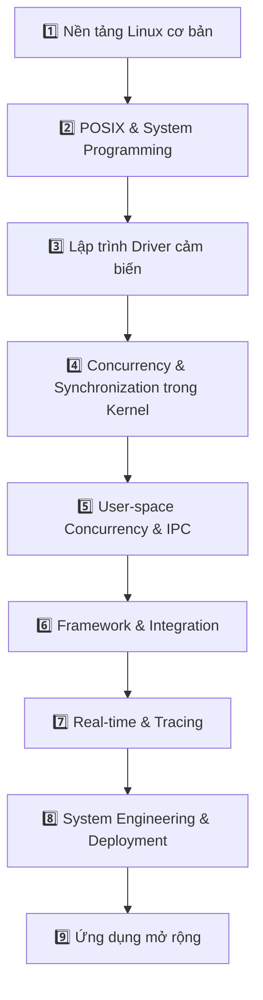
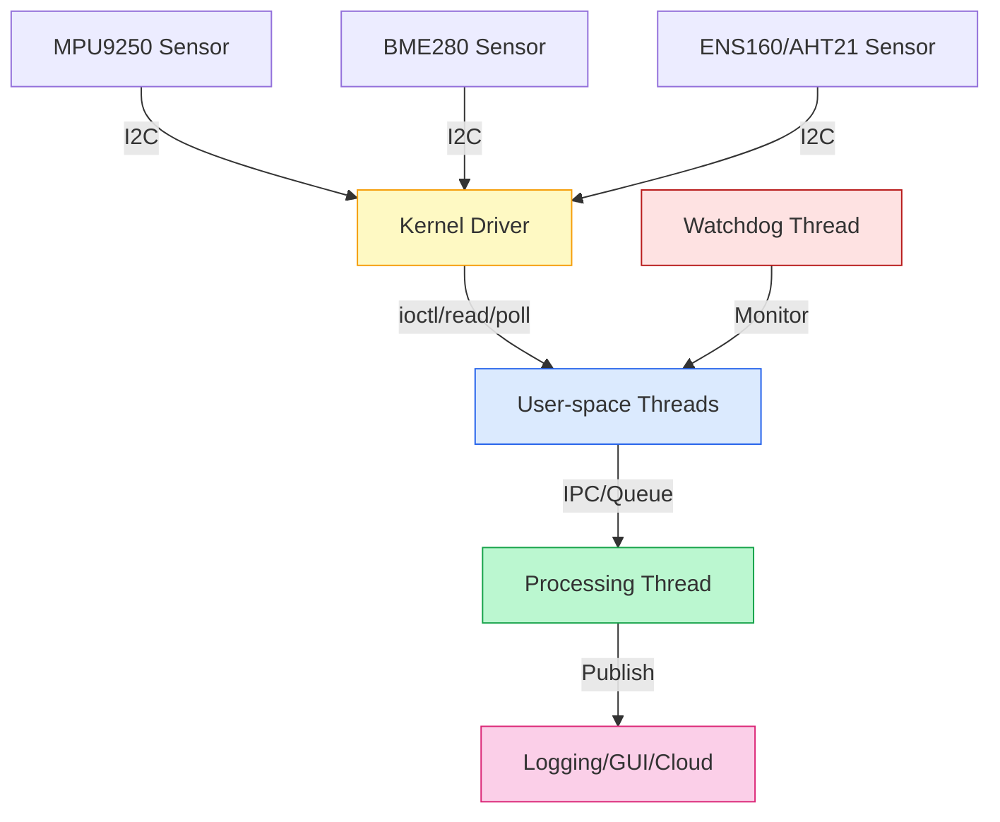
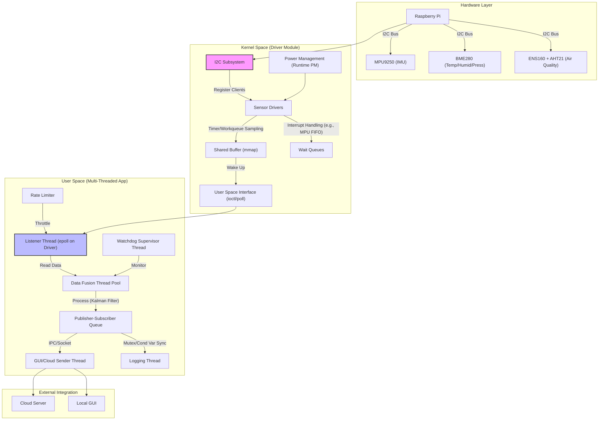

# DASCA-Design-Advanced-Sensor-Concurrency-Architecture

```mermaid
graph TD
A[1️⃣ Nền tảng Linux cơ bản] --> B[2️⃣ POSIX & System Programming]
B --> C[3️⃣ Lập trình Driver cảm biến]
C --> D[4️⃣ Concurrency & Synchronization trong Kernel]
D --> E[5️⃣ User-space Concurrency & IPC]
E --> F[6️⃣ Framework & Integration]
F --> G[7️⃣ Real-time & Tracing]
G --> H[8️⃣ System Engineering & Deployment]
H --> I[9️⃣ Ứng dụng mở rộng]
```

```mermaid
graph TD
    A[MPU9250 Sensor] -->|I2C| K[Kernel Driver]
    B[BME280 Sensor] -->|I2C| K
    C[ENS160/AHT21 Sensor] -->|I2C| K
    K -->|ioctl/read/poll| U[User-space Threads]
    U -->|IPC/Queue| P[Processing Thread]
    P -->|Publish| L[Logging/GUI/Cloud]
    W[Watchdog Thread] -->|Monitor| U
    style K fill:#fef9c3,stroke:#f59e0b
    style U fill:#dbeafe,stroke:#2563eb
    style P fill:#bbf7d0,stroke:#16a34a
    style L fill:#fbcfe8,stroke:#db2777
    style W fill:#fee2e2,stroke:#b91c1c
```

```mermaid
graph TD
    subgraph "Hardware Layer"
        A["Raspberry Pi"] -->|"I2C Bus"| B["MPU9250 (IMU)"]
        A -->|"I2C Bus"| C["BME280 (Temp/Humid/Press)"]
        A -->|"I2C Bus"| D["ENS160 + AHT21 (Air Quality)"]
    end

    subgraph "Kernel Space (Driver Module)"
        E["I2C Subsystem"] -->|"Register Clients"| F["Sensor Drivers"]
        F -->|"Timer/Workqueue Sampling"| G["Shared Buffer (mmap)"]
        F -->|"Interrupt Handling (e.g., MPU FIFO)"| H["Wait Queues"]
        G -->|"Wake Up"| I["User Space Interface (ioctl/poll)"]
        J["Power Management (Runtime PM)"] --> F
    end

    subgraph "User Space (Multi-Threaded App)"
        K["Listener Thread (epoll on Driver)"] -->|"Read Data"| L["Data Fusion Thread Pool"]
        L -->|"Process (Kalman Filter)"| M["Publisher-Subscriber Queue"]
        M -->|"IPC/Socket"| N["GUI/Cloud Sender Thread"]
        M -->|"Mutex/Cond Var Sync"| O["Logging Thread"]
        P["Watchdog Supervisor Thread"] -->|"Monitor"| L
        Q["Rate Limiter"] -->|"Throttle"| K
    end

    subgraph "External Integration"
        N --> R["Cloud Server"]
        N --> S["Local GUI"]
    end

    A --> E
    I --> K
    style E fill:#f9f,stroke:#333,stroke-width:2px
    style K fill:#bbf,stroke:#333,stroke-width:2px
```
