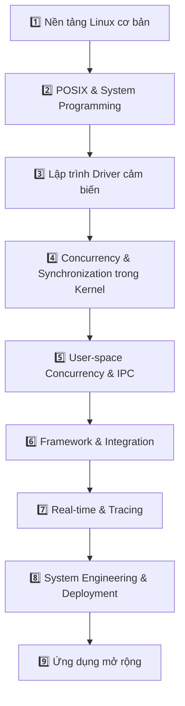
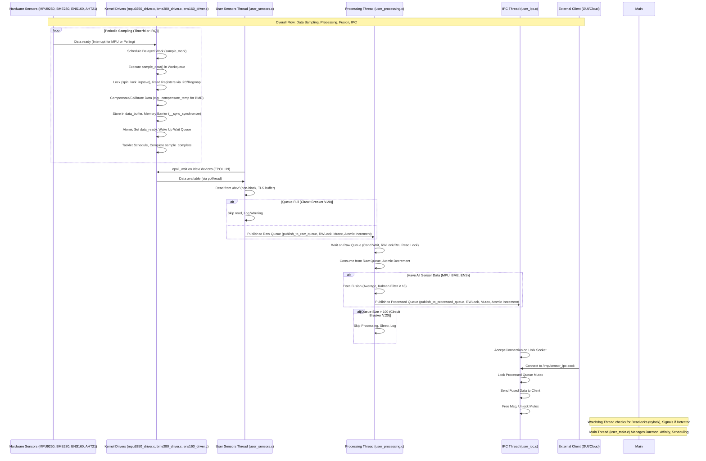
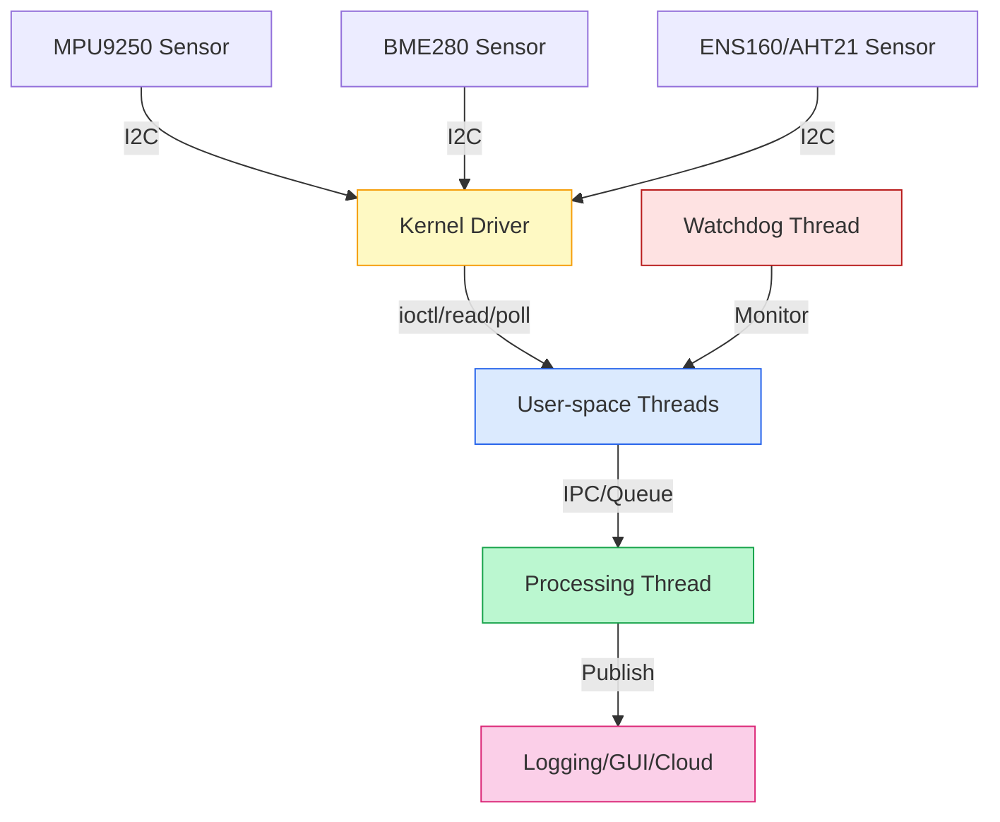
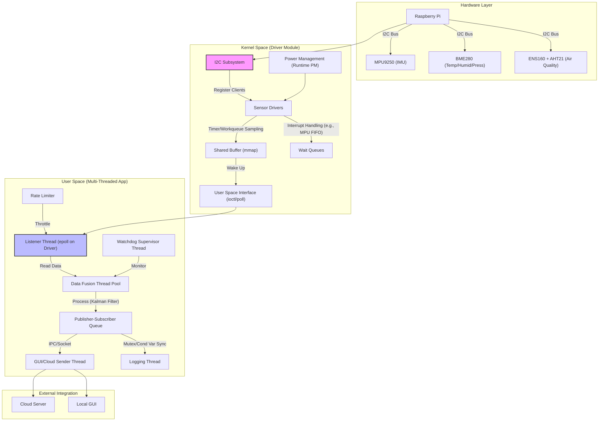
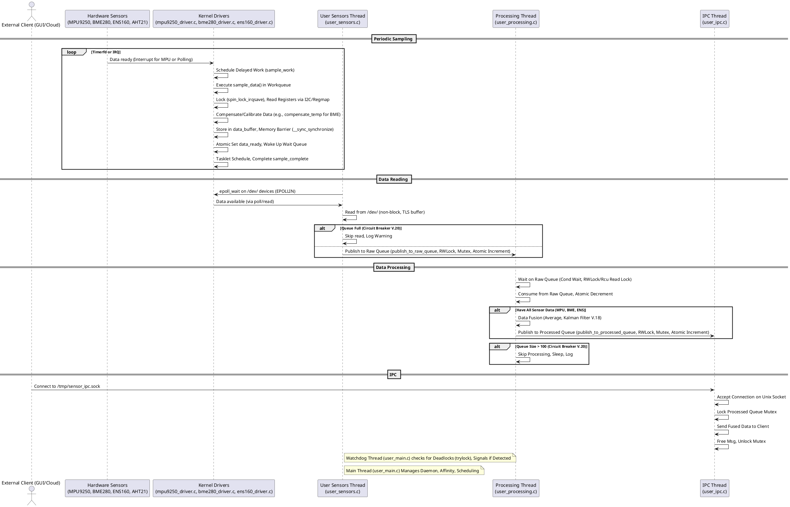

# DASCA-Design-Advanced-Sensor-Concurrency-Architecture

### Technologies and Techniques Used

This project demonstrates a wide range of Linux kernel and user-space development techniques, focusing on concurrency, sensor integration, and real-time data processing on Raspberry Pi.

#### Kernel Space Techniques
- ✅ Device Tree Overlays (DTO) for hardware configuration (I2C bus enabling, interrupt mapping).
- ✅ I2C Kernel Drivers with regmap for register access.
- ✅ Character Devices (/dev/) with file operations (read, poll, mmap).
- ✅ Workqueues and Delayed Work for deferred sensor sampling.
- ✅ Tasklets as bottom-half interrupt handlers.
- ✅ Spinlocks (with IRQ save) for critical section protection.
- ✅ Atomic Variables for lock-free data ready signaling.
- ✅ Wait Queues and Poll for user-space notification.
- ✅ Completions for synchronization between work and reads.
- ✅ DMA Coherent Buffers for shared memory (mmap support).
- ✅ Memory Barriers (__sync_synchronize()) for multi-core consistency.
- ✅ PM Runtime for power management in drivers.
- ✅ Debugfs and Sysfs for metrics and status monitoring.
- ✅ Interrupt Handling (IRQ for MPU9250, rising edge).
- ✅ Compensation Algorithms (e.g., temperature/pressure/humidity in BME280).
- ✅ CRC Checks and Error Handling (e.g., in ENS160/AHT21).
- ✅ Module Build/Install via Makefile (obj-m, depmod).
- ✅ Placeholders for Advanced: RCU (lock-free reads), eBPF (bottlenecks profiling), Buffer Overflow Checks.

#### User Space Techniques
- ✅ Daemonization (fork, setsid, umask, redirect stdio).
- ✅ Signal Handling (SIGINT, SIGTERM, SIGALRM) with sigaction.
- ✅ Multi-Threading with Pthreads (creation, affinity, scheduling policies: FIFO/RR).
- ✅ Thread Synchronization: Mutexes (recursive), Condition Variables, RW Locks, Semaphores (bounded).
- ✅ Atomic Operations (stdatomic.h) for lock-free queue size management.
- ✅ Barrier Synchronization (pthread_barrier) for thread startup.
- ✅ Epoll for I/O multiplexing on /dev/ devices.
- ✅ Timerfd for periodic signaling (10Hz sampling).
- ✅ Thread-Local Storage (__thread) for buffers.
- ✅ Queues (Linked Lists) for data buffering (raw and processed).
- ✅ Data Fusion with Simple Kalman Filter.
- ✅ Circuit Breaker Pattern for queue overflow handling.
- ✅ Unix Domain Sockets for IPC (bind, listen, accept, send).
- ✅ Cleanup Handlers (pthread_cleanup_push/pop) for resource release.
- ✅ Watchdog Thread for deadlock detection (trylock checks).
- ✅ Logging with Syslog for daemon errors/warnings.
- ✅ CPU Affinity (sched_setaffinity) for multi-core optimization.
- ✅ Cancellation Points and Types (deferred/async) for thread control.
- ✅ Zombie Prevention (waitpid WNOHANG).
- ✅ Placeholders for: RCU emulation (user-space), Fuzzing/Testing Targets in Makefile.

#### General Project Techniques
- ✅ Makefile for Dual Build (kernel modules + user app), Install, Clean, Test (Google Test), Fuzz (LibFuzzer), Deploy (Yocto-like).
- ✅ Security: Comments on AppArmor, Secure Boot, ASLR.
- ✅ Testing/Optimization: Comments on Stress-ng, Perf, Integration Tests.
- ✅ Future Enhancements: Rust Kernel Modules, FreeRTOS Alternative, eBPF Hooks.

This checklist highlights the project's focus on concurrency architecture (V.15-V.24 as per code comments), ensuring thread-safety, real-time performance, and scalability.

1. PlantUML Component Diagram

```plantuml
@startuml
package "Hardware Layer" {
  [I2C Bus 1] --> [MPU9250 Sensor @0x68] : Interrupts (GPIO17)
  [I2C Bus 1] --> [BME280 Sensor @0x76]
  [I2C Bus 1] --> [ENS160 Sensor @0x52]
  [I2C Bus 1] --> [AHT21 Sensor @0x38]
}

package "Kernel Space" {
  [bme280-overlay.dts] --> [Linux Kernel] : Config I2C & Interrupts
  [Linux Kernel] --> [Makefile\n(all-kernel, install-kernel)] : Build & Install Modules
  [Linux Kernel] --> [mpu9250_driver.c\nIRQ Handler, Workqueue, Tasklet, Spinlock, DMA, Debugfs]
  [Linux Kernel] --> [bme280_driver.c\nWorkqueue, Tasklet, Spinlock, DMA, Compensation Funcs]
  [Linux Kernel] --> [ens160_driver.c\nWorkqueue, Tasklet, Spinlock, DMA, CRC Check]
  [mpu9250_driver.c] --> [/dev/mpu9250] : Expose
  [bme280_driver.c] --> [/dev/bme280] : Expose
  [ens160_driver.c] --> [/dev/ens160] : Expose
}

package "User Space (sensor_app)" {
  [user_main.c\nDaemonize, Signals, Watchdog, Thread Affinity, SCHED_FIFO/RR] --> [user_sensors.c\nEpoll, Timerfd, Semaphore, Circuit Breaker, TLS Buffer] : Create Threads
  [user_main.c] --> [user_processing.c\nQueues, RWLock, Cond, Atomic Queue Size, Kalman Filter, Circuit Breaker]
  [user_main.c] --> [user_ipc.c\nUnix Socket IPC, Mutex]
  [user_sensors.c] --> [/dev/mpu9250] : Read Data
  [user_sensors.c] --> [/dev/bme280] : Read Data
  [user_sensors.c] --> [/dev/ens160] : Read Data
  [user_sensors.c] --> [Raw Queue\n(Linked List, Mutex, Cond)] : Publish
  [user_processing.c] --> [Raw Queue] : Consume & Fuse
  [user_processing.c] --> [Processed Queue\n(Linked List, Mutex, Cond)] : Publish Fused
  [user_ipc.c] --> [Processed Queue] : Send to Clients
  [user_main.c] --> [Makefile\n(all-user, install-user, test, fuzz, deploy)] : Build & Install App
}

[Hardware Layer] --> [Kernel Space] : I2C Access
[Kernel Space] --> [User Space] : Char Devices (/dev/)
@enduml
```

2. PlantUML Sequence Diagram

# Outline Hoàn Chỉnh Về Concurrency Trong Linux & Embedded Systems

Dưới đây là outline hoàn chỉnh, được mở rộng dựa trên nội dung gốc bạn cung cấp, với các bổ sung để đạt mức "expert design architect concurrency". Tôi đã tích hợp các phần mới để tập trung vào performance, security, testing, embedded-specific (liên quan Raspberry Pi và I2C sensors), và một level mới "Mastery Level" để làm cho nó production-ready. Outline được tổ chức theo các level từ Beginner đến Mastery, với các chủ đề con chi tiết hơn.

Outline này được thiết kế cho dự án của bạn: Thiết kế architecture concurrency cho Raspberry Pi với các sensor I2C (MPU9250, BME280, ENS160+AHT21), bao gồm kernel space (driver với workqueue/timer) và user space (multi-threaded app với IPC/publisher-subscriber).

## 🧩 I. BEGINNER LEVEL — CƠ SỞ NỀN TẢNG LINUX & C
1️ **C Programming Refresher**  
   - Biến, con trỏ, struct, union, enum  
   - Hàm, scope, static, extern  
   - Quản lý bộ nhớ: malloc, calloc, realloc, free  
   - Stack, Heap, Data segment, Code segment  
   - Function pointer (callback chuẩn bị cho ITC)  
   - *Bổ sung*: Memory barriers (__sync_synchronize() trong GCC) để tránh reordering trong concurrency  

2️ **Linux File & System Calls**  
   - open(), read(), write(), lseek(), close()  
   - Blocking vs Non-blocking I/O  
   - Atomic operations, Race condition cơ bản  
   - User mode ↔ Kernel mode  
   - *Bổ sung*: fcntl() cho file locking, ioctl() cơ bản để chuẩn bị cho driver interaction  

3️ **Process Management**  
   - fork(), exec(), wait(), exit(), PID  
   - Parent-child process & zombie process  
   - Process memory layout  
   - Daemon process & background service  

4️ **Signals**  
   - signal(), sigaction(), signal handler  
   - Gửi tín hiệu: kill(), raise()  
   - Signal-safe functions  
   - Sử dụng signals trong concurrency  

## 🧵 II. INTERMEDIATE LEVEL — MULTITHREADING & SYNCHRONIZATION
5️ **POSIX Threads (pthread)**  
   - Thread creation & termination  
   - Joinable vs Detached threads  
   - Passing arguments & stack management  
   - Race condition on thread creation  

6️ **Thread Synchronization**  
   - Critical section & mutual exclusion  
   - Mutex & Condition Variables  
   - Spurious wakeups & broadcasting  
   - Thread-safe design patterns  
   - *Bổ sung*: Futex (fast user-space mutex) cho low-latency locking  

7️ **Advanced Thread Patterns**  
   - Reader-Writer Locks  
   - Recursive Mutexes  
   - Barriers (pthread_barrier_t)  
   - Thread Pools / Work Crew Model  
   - Monitor pattern (Reader-Writer Monitor)  
   - *Bổ sung*: Thread-Local Storage (TLS với __thread) để tránh global variables races  

## ⚙️ III. ADVANCED LEVEL — CONCURRENCY DESIGN & IPC
8️ **Inter-Thread Communication (ITC)**  
   - Callback & Function pointer  
   - Notification chain & event-driven model  
   - Publisher-Subscriber architecture  
   - Thread-safe message queue  

9️ **Inter-Process Communication (IPC)**  
   - Pipes & Named Pipes (FIFO)  
   - POSIX Message Queue  
   - POSIX Shared Memory (mmap)  
   - POSIX Semaphores  
   - Event-pair synchronization  
   - *Bổ sung*: Unix Domain Sockets cho local IPC high-performance, D-Bus cho system-wide event bus  

10 **Thread Cancellation & Cleanup**  
   - Async vs Deferred cancellation  
   - Cleanup handlers, deadlock & invariant  
   - Cancellation-safe code  
   - *Bổ sung*: Cancellation points in I/O operations, integrate với signal handlers  

11 **Classical Synchronization Problems**  
   - Producer-Consumer  
   - Dining Philosophers  
   - Readers-Writers  
   - Strict Alternation Problem  
   - Deadlock detection & avoidance  
   - *Bổ sung*: Sleeping Barber Problem, Banker's Algorithm cho deadlock avoidance thực tế  

## 🧮 IV. EXPERT LEVEL — REAL SYSTEM CONCURRENCY
12 **Multi-threaded Design Models**  
   - Listener Threads (Responsibility Delegation)  
   - Assembly Line Model (Pipeline Processing)  
   - Bounded Waiting / FIFO Semaphores  
   - Timers & Watchdog Threads  
   - Thread Hierarchies (Supervisor Threads)  
   - *Bổ sung*: Leader-Follower Model (cho I/O multiplexing), Half-Sync/Half-Async  

13 **Deadlock Detection & Prevention**  
   - Resource hierarchy & lock ordering  
   - Deadlock graph detection  
   - Wait-for graph algorithm  
   - *Bổ sung*: Helgrind (Valgrind) cho runtime detection, Chandy-Misra algorithm  

14 **Asynchronous Programming & Event Loops**  
   - Non-blocking I/O (select, poll, epoll)  
   - Callback-based event systems  
   - Asynchronous timer (timerfd)  
   - Reactor & Proactor patterns  
   - *Bổ sung*: Libevent/libuv để implement reactor, kqueue so sánh với epoll  

15 **Real-Time Multithreading**  
   - Scheduling (SCHED_FIFO, SCHED_RR)  
   - Thread priority & affinity  
   - Real-time guarantees & latency control  
   - Lock-free data structures (atomic ops)  
   - *Bổ sung*: RCU (Read-Copy-Update) cho lock-free reads, sched_setaffinity() cho Raspberry Pi multi-core  

## 🧠 V. ARCHITECT LEVEL — SYSTEM & DRIVER CONCURRENCY
16 **Kernel-Space Concurrency**  
   - Kernel threads & workqueue  
   - Bottom half & tasklets  
   - Spinlocks, mutexes, semaphores in kernel  
   - Wait queues (wait_event, wake_up)  
   - Completion structures  
   - Interrupt handling & deferred work  
   - *Bổ sung*: SoftIRQ/NAPI cho network concurrency, preemptible kernel config  

17 **Kernel ↔ User Communication**  
   - ioctl, read, write, poll trong driver  
   - Blocking vs Non-blocking read  
   - Shared buffer & mmap driver interface  
   - *Bổ sung*: Sysfs/netlink cho debug, debugfs để expose metrics  

18 **Driver Architecture for I²C Sensors**  
   - I²C subsystem & i2c_client  
   - Sensor abstraction (MPU9250, BME280, ENS160)  
   - Data fusion & filtering thread  
   - Workqueue & timer-based sampling  
   - Power management integration  
   - *Bổ sung*: Device Tree Overlay (DTO) cho Raspberry Pi, regmap API, runtime PM (pm_runtime_get/put)  

19 **Full System Concurrency Architecture**  
   - Multi-threaded user app đọc driver  
   - IPC/Socket gửi dữ liệu sang GUI/Cloud  
   - Parallel data acquisition & logging  
   - Publish/Subscribe trong user space  
   - Real-time kernel sampling  
   - *Bổ sung*: Fault Tolerance với watchdog (Raspberry Pi hardware), cgroup/v2 cho resource limit  

20 **Design Patterns cho Embedded Concurrency**  
   - Observer / Publisher-Subscriber  
   - Reactor (event-driven sensor handling)  
   - Active Object (background data processing)  
   - Monitor (synchronized data access)  
   - Pipeline / Assembly Line (multi-stage processing)  
   - *Bổ sung*: Circuit Breaker (cho cloud retry), Rate Limiter (throttle sampling), FSM với concurrency  

## 🔮 VI. MASTERY LEVEL — OPTIMIZATION, SECURITY & DEPLOYMENT (Bổ Sung Mới Để Đạt Expert Architect)
21 **Performance Optimization & Profiling**  
   - Perf tool, flame graphs, eBPF để trace bottlenecks  
   - Cache coherence in multi-core (Raspberry Pi 4+)  
   - Latency measurement cho I2C sampling  

22 **Security in Concurrency**  
   - Thread injection attacks, ASLR  
   - Secure coding (avoid buffer overflows in shared memory)  
   - SELinux/AppArmor cho IPC protection  
   - Embedded security: Secure boot cho Raspberry Pi  

23 **Testing & Validation**  
   - Fuzzing concurrency với libfuzzer  
   - Stress-ng cho race simulation  
   - Unit tests với Google Test + mock kernel interfaces  
   - Integration testing cho sensor data fusion  

24 **Embedded Deployment & Case Studies**  
   - Yocto/Buildroot cho custom image  
   - Over-the-air updates  
   - Case study từ ROS (Robot OS) hoặc Automotive Grade Linux với I2C concurrency  

25 **Future-Proofing**  
   - Rust in Linux kernel cho safer concurrency  
   - Comparison với RTOS (FreeRTOS) nếu migrate từ Linux  
   - Scalability cho multi-Raspberry Pi cluster  

